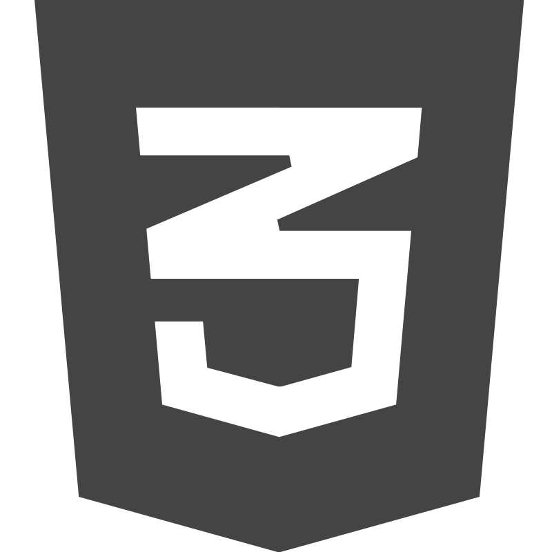

# LIUBOU LEVITSKAYA 

### CONTACTS
* __Location:__ Minsk, Belarus
* __Discord:__ Liubou Levitskaya(@L-Liubou)
* __GitHub:__ [L-Liubou](https://github.com/L-Liubou)
* __Telegram:__ [liubou_levitskaya](https://t.me/liubou_levitskaya)

************

### ABOUT ME
As an aspiring frontend developer, my goal is to translate ideas and requirements into well-thought-out, easily recognizable interfaces. Working at the intersection of creativity and technology inspires me, where programming, design, and user experience come together to create user-friendly and attractive products. I strive to find the balance between aesthetics, functionality, and simplicity, ensuring that every element of interaction is meaningful and effective.

***********  

### MY SKILLS

   


*_all in progress_

***********  

### CODE EXAMPLE

Complete the function powerOfTwo that determines if a given non-negative integer is a power of two. From the corresponding Wikipedia entry:
>a power of two is a number of the form 2n where n is an integer, i.e. the result of exponentiation with number two as the base and integer n as the exponent.

```  
function powerOfTwo(n) {
  return (n > 0) && ((n & (n-1)) === 0)
}
```  

***********  

### EDUCATION
* Vitebsk State Order of Peoples' Friendship Medical University
* RS Schools «JS-FE Pre School» Course
* [RS Schools «JavaScript / Front-end» Course](https://rs.school/courses/javascript-ru) _in progress_

***********

### ENGLISH LEVEL
Intermediate to Upper-Intermediate (B1-B2)

***********  

[](https://rs.school/)
